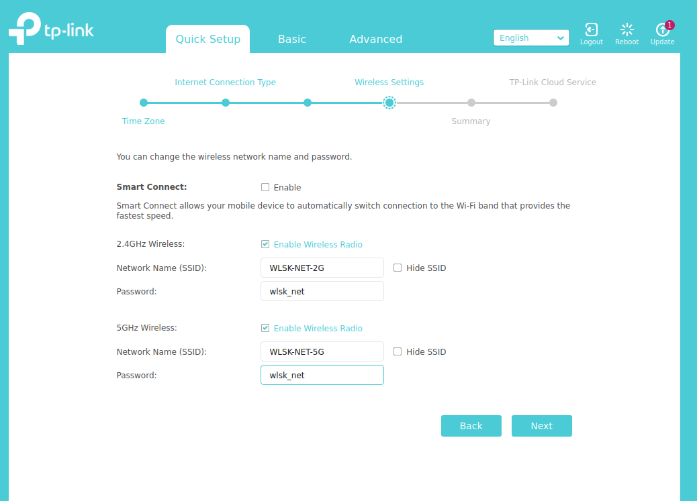
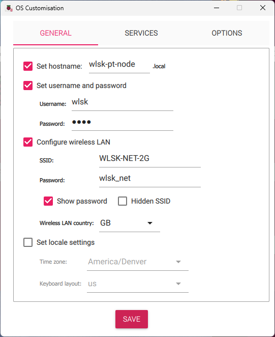
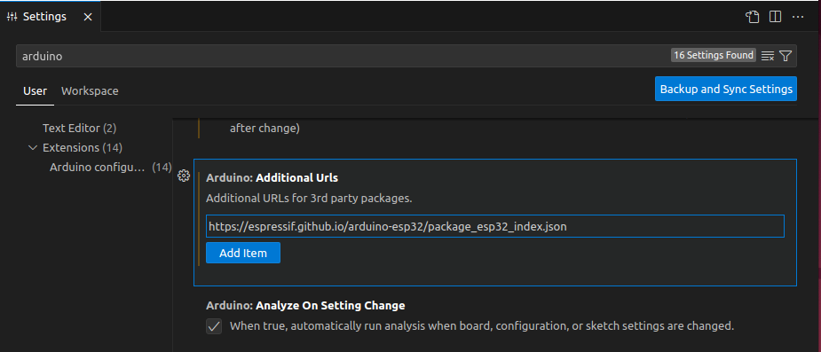
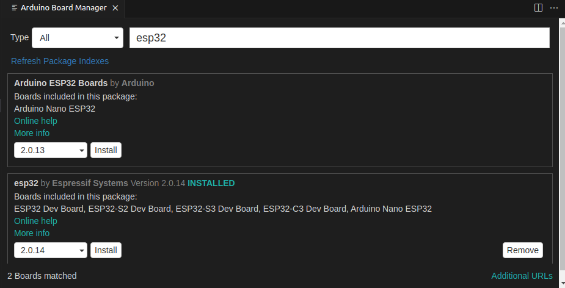
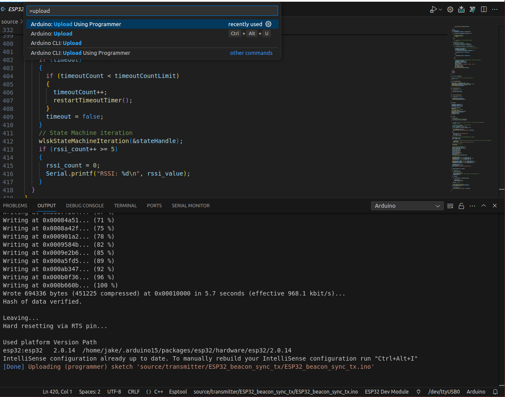

# Wireless Latency Shift Keying
This repository contains the source code for the Wireless Latency Shift Keying project, and is made public as part of the MobiCom 2024 conference paper.

## Hardware and Software Requirements 
The following hardware items are required to run this software:
- WiFi router - 802.11ac or newer with at least one extra Ethernet port
- ESP32 development board, similar to the one shown here: https://docs.espressif.com/projects/esp-idf/en/latest/esp32/hw-reference/esp32/get-started-devkitc.html 
- Linux PC or VM, connected via Ethernet to the WiFi router. (Use "Bridged Mode" if using Linux VM)

The test PC needs to have the following software installed:
- Python 3, with `pip` and `venv` available 
- Either Arduino IDE or Visual Studio Code with Arduino Extension

## Overview and Setup 
### Network Setup
The Wireless router should be set up to have separate 2.4 and 5 GHz SSIDs, as shown here:
  


Note that the SSID "WSLK-NET-2G" is used since several parts of the code assume that SSID for convenience. If a different network SSID is used, changes will need to be made to the code prior to running, as described below. 

Once the network is set up, the test machine should be connected via Ethernet to the wireless router. 

### Ping Reflector Setup 
A Raspberry Pi 4 is used as a ping reflector. The easiest way to set up the Pi is to use the Raspberry Pi Imager tool, available here: https://www.raspberrypi.com/software/. 

Prior to flashing the SD card with Raspberry Pi OS, select the "Customize OS" option to pre-configure the following key items:
- hostname
- WLAN credentials 



If this is done correctly, the Pi will automatically connect to the 2.4 GHz WiFi network and advertise its hostname upon booting. You should be able to ping it by its hostname to verify that everything is working correctly: 

```shell
$ ping wlsk-pt-node.local
PING wlsk-pt-node.local (192.168.0.236) 56(84) bytes of data.
64 bytes from 192.168.0.236 (192.168.0.236): icmp_seq=1 ttl=64 time=1.76 ms
64 bytes from 192.168.0.236 (192.168.0.236): icmp_seq=2 ttl=64 time=2.53 ms
64 bytes from 192.168.0.236 (192.168.0.236): icmp_seq=3 ttl=64 time=2.18 ms
64 bytes from 192.168.0.236 (192.168.0.236): icmp_seq=4 ttl=64 time=1.91 ms
^C
--- wlsk-pt-node.local ping statistics ---
4 packets transmitted, 4 received, 0% packet loss, time 3097ms
rtt min/avg/max/mdev = 1.762/2.093/2.527/0.290 ms
```

### WLSK Transmitter Setup
The ESP32 development board is used as the WLSK transmitter. To flash it, the Arduino IDE or Visual Studio Code with the Arduino Extension is required. 

First, add the following URL to the "Additional Board URLs" field in the IDE. In Visual Studio Code, open the settings with `CTRL + ,`, and search for "arduino". Add the following URL as shown below: https://espressif.github.io/arduino-esp32/package_esp32_index.json



Then, open up the board manager (In VS Code, `CTRL + SHIFT + p` then search for "Board Manager"), and search for "esp32". Install the `esp32` package as shown below:



Prior to flashing, determine the 2.4 GHz channel that your wireless network, and update line 24 of `source/transmitter/ESP32_beacon_sync_tx/ESP32_beacon_sync_tx.ino`:

```c
uint8_t channel = 4;
```

If a WiFi SSID that was not `WLSK-NET-2G` was used, then update the SSID field in line 194 of `source/transmitter/ESP32_beacon_sync_tx/wifi_func.h`:

```c
if (!(strcmp(ssid, "WLSK-NET-2G")))
```

To recompile and flash the ESP32 development board, first connect it to the PC via USB cable and identify the serial port. Specify the Development board type and serial port then use the `Arduino: Upload Using Programmer` command from the VS code menu, as shown below: 



> NOTE: If you get an error with the upload that the serial port doesn't exist, you may need to issue the following command (customize for the serial port your dev board is connected to): `sudo chmod 666 /dev//ttyUSB0`

> NOTE: To monitor the serial output of the ESP32 dev board, the `Arduino: Open Serial Monitor` command can be used (Baud Rate is 115200)


### Test machine setup 
To prep the test machine to run the test, two steps are needed. First, install the virtual environment and install the python dependencies with 

```shell
source setup_python_env.sh`
```

Next, update the desired configuration file. The following values are required to be customized to the test machine / setup:
- `rx_params.rx_interface` - This should be set to the interface name of the Ethernet adapter of the test machine that is connected to the wirelss router. (Can be obtained with the `ifconfig` command)
- `rx_params.r_target_ips` - This should be set to the network hostname (or IP address) of the raspberry pi ping target
- `tx_params.serial_port_names` - This should be set to the serial port that the ESP32 is connected to

## Running a Test 

To run a test, first create a test directory `mkdir ./tests`

Then run the test with 
```shell
$ sudo python3 source/receiver/rx.py ./tests/<test_name> <config_file_path> 
```

The test takes about a minute to run, and the output should look like this:
```shell
$ sudo python3 source/receiver/rx.py ./tests/test0 ./config/wlsk-1-channel-config.json 
Starting Receiver..
Output directory: ./tests/test0
               Config Directory: ./config/wlsk-1-channel-config.json
Initializing WLSK Receiver...
Overriding existing output directory
RX Initialized! Data will be output to: ./tests/test0
Using Serial port: /dev/ttyUSB0
Starting receiver for 
Sniffing on interface: enp0s3...
Resolving wlsk-pt-node.local to 192.168.0.236
Obtaining the raw data from the Queue
Sending 8500 packets at an interval of 0.005
Done sending
Done Sniffing
Data successfully obtained!
Closed Processes
Creating directory and saving the data
Finished Receiving Test Iteration: test_iter_0
/media/sf_git/wireless-latency-shift-keying/source/receiver/decoder.py:86: FutureWarning: Series.fillna with 'method' is deprecated and will raise in a future version. Use obj.ffill() or obj.bfill() instead.
  var_data = raw_data.rolling(window=window_size).var().fillna(method='bfill')
threshold for sync detect: 1121.1402394871095
cutoff is 10000
Using Sync Word idx: 5129
0 5 6256
Eval X coordinates: [6261, 7384, 8510, 9637, 10764, 11891, 13018, 14145, 15272, 16399, 17526, 18653, 19780, 20907, 22034, 23161, 24288, 25415, 26542, 27669, 28796, 29923, 31050, 32177, 33304, 34431, 35558, 36685, 37812, 38939, 40066, 41193]
Decoded: [1, 1, 1, 1, 1, 0, 1, 1, 1, 1, 1, 1, 0, 1, 0, 1, 1, 0, 0, 0, 1, 0, 0, 0, 0, 1, 0, 1, 1, 0, 0, 1]
Expected: [1, 1, 1, 1, 1, 0, 1, 1, 1, 1, 1, 1, 0, 1, 0, 1, 1, 0, 0, 0, 1, 0, 0, 0, 0, 1, 0, 1, 1, 0, 0, 1]
BER of test_iter_0 channel 0 is 0.0
```

The test data and graphical output is saved in the specified test output directory. 